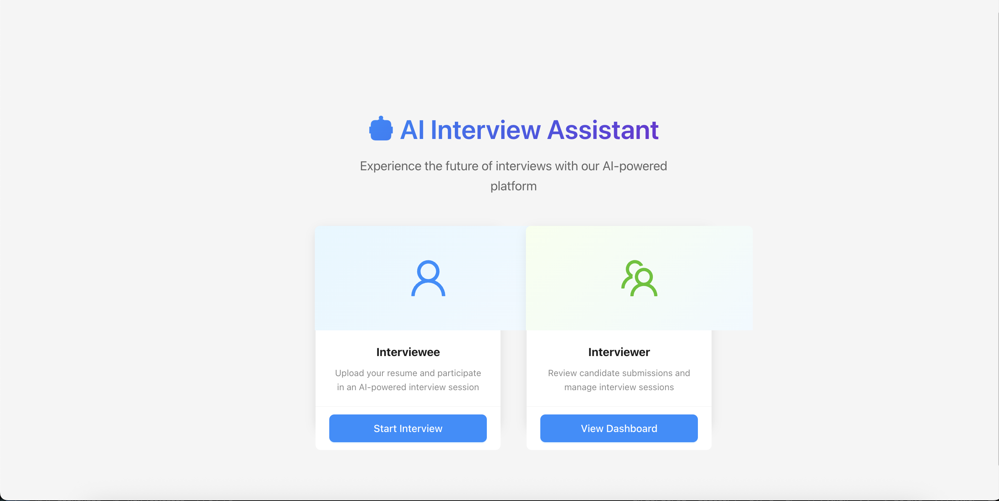

# 🤖 AI Interview Assistant

> **A comprehensive React-based intelligent interview platform that automates resume parsing, conducts AI-powered technical interviews, and provides detailed candidate evaluations.**



[](https://www.typescriptlang.org/)
[](https://reactjs.org/)
[](https://vitejs.dev/)
[](https://ant.design/)

## � **Demo & Live Application**

### 🚀 **Live Demo**
**[🔗 Try the Live Application](https://ai-interview-assistant-amber.vercel.app/)**

### 📹 **Demo Video**
<!-- Replace with your demo video -->
**[📺 Watch Demo Video](https://drive.google.com/file/d/1Io2egzWlPTMBVyiOdq2aGvfsxy2vjO9q/view?usp=drive_link)**

*Demo shows complete interview flow: resume upload → AI question generation → real-time evaluation → detailed results*

---

## �🎯 **Project Overview**

The AI Interview Assistant is a modern, React-based frontend application designed to revolutionize the technical interview process. Built with cutting-edge technologies, it provides a comprehensive client-side solution for conducting, evaluating, and managing technical interviews with AI integration.

### 🏆 **Key Achievements**
- **Intelligent Resume Parsing**: Extracts contact info, skills, and education from PDF/DOCX files
- **AI-Powered Interviews**: Generates personalized questions based on candidate background
- **Real-Time Evaluation**: Provides instant scoring and detailed feedback
- **Professional Dashboard**: Comprehensive candidate management and analytics
- **Responsive Design**: Seamless experience across all devices

## ✨ **Core Features**

### 📄 **Smart Resume Processing**
```
📁 Upload PDF/DOCX → 🤖 AI Analysis → 📋 Auto-Fill Form → ✅ Ready to Interview
```
- **Multi-format Support**: PDF and DOCX resume parsing
- **Intelligent Extraction**: Name, email, phone, education, and 60+ technical skills
- **Auto-Fill Forms**: Extracted data automatically populates candidate forms
- **Visual Skills Display**: Skills shown as professional tags
- **Validation & Feedback**: Real-time data validation with quality scoring

### 🎤 **Interactive Interview System**
- **Personalized Questions**: AI generates questions based on resume content
- **Timed Responses**: Smart timer system with auto-submit functionality
- **Progressive Difficulty**: Easy (20s) → Medium (60s) → Hard (2min) questions
- **Real-Time Feedback**: Live timer, progress tracking, and status updates

### 📊 **Comprehensive Evaluation**
- **Detailed Scoring**: Individual question scores and overall performance rating
- **Q&A Review**: Complete question-answer pairs with time metrics
- **Performance Analytics**: Strengths, improvements, and personalized recommendations
- **Interview Summary**: Professional evaluation reports with actionable insights

### 👥 **Dual-Interface Design**
- **Candidate Portal**: Clean, intuitive interview experience
- **Interviewer Dashboard**: Professional candidate management interface
- **Real-Time Updates**: Live interview progress and status tracking
- **Search & Filter**: Advanced candidate search and sorting capabilities

## 🛠️ **Technology Stack**

### **Frontend**
- **React 19** - Latest React with modern hooks and Suspense
- **TypeScript** - Full type safety and enhanced developer experience
- **Ant Design** - Professional UI component library
- **Redux Toolkit** - Efficient state management with persistence
- **Vite** - Lightning-fast build tool and dev server

### **File Processing**
- **PDF.js** - Client-side PDF text extraction
- **Mammoth.js** - DOCX document processing
- **Advanced Regex** - Intelligent contact information extraction

### **AI Integration**
- **Groq API** - Fast AI inference for question generation
- **Local Fallback** - Robust offline question generation
- **Smart Evaluation** - Automated answer scoring and feedback

### **Development Tools**
- **Vitest** - Modern testing framework
- **ESLint + Prettier** - Code quality and formatting
- **TypeScript Strict Mode** - Enhanced type checking
- **Git Hooks** - Automated code quality checks

## 🚀 **Quick Start**

### **Prerequisites**
- Node.js 18+ and npm
- Modern web browser with JavaScript enabled

### **Installation**
```bash
# Clone the repository
git clone <repository-url>
cd ai-interview-assistant

# Install dependencies
npm install

# Set up environment variables
cp .env.example .env
# Edit .env with your API keys (optional for basic functionality)

# Start development server
npm run dev
```

### **Build for Production**
```bash
# Create optimized production build
npm run build

# Preview production build locally
npm run preview
```

## 🎮 **Usage Guide**

### **For Candidates (Interviewees)**
1. **Upload Resume**: Drag & drop PDF/DOCX file
2. **Review Auto-Fill**: Verify extracted information and skills
3. **Start Interview**: Begin with personal introduction
4. **Answer Questions**: Complete timed technical questions
5. **View Results**: Get detailed performance evaluation

### **For Interviewers**
1. **Access Dashboard**: Navigate to interviewer portal
2. **View Candidates**: Browse all interview submissions
3. **Review Details**: Check scores, progress, and Q&A pairs
4. **Download Reports**: Export candidate evaluations

## 📁 **Project Structure**

```
ai-interview-assistant/
├── 📁 src/
│   ├── 📁 components/          # React components
│   │   ├── 📁 common/         # Shared components
│   │   ├── 📁 interviewee/    # Candidate interface
│   │   └── 📁 interviewer/    # Dashboard interface
│   ├── 📁 services/           # Business logic & APIs
│   ├── 📁 store/              # Redux state management
│   ├── 📁 types/              # TypeScript definitions
│   └── 📁 utils/              # Helper functions
├── 📁 public/                 # Static assets
├── 📁 api/                    # API endpoints (future)
├── 📄 package.json            # Dependencies & scripts
├── 📄 tsconfig.json           # TypeScript configuration
├── 📄 vite.config.ts          # Build configuration
└── 📄 README.md               # Project documentation
```

## 🧪 **Testing**

```bash
# Run unit tests
npm run test

# Run tests with coverage
npm run test:coverage

# Run tests in watch mode
npm run test:watch
```

**Testing Coverage:**
- Component rendering and interactions
- Resume parsing functionality
- State management logic
- API integration tests

## 🔧 **Configuration**

### **Environment Variables**
```bash
# .env file
VITE_GROQ_API_KEY=your_groq_api_key_here      # Optional
VITE_ENVIRONMENT=development                   # development/production
```

### **Build Configuration**
- **Vite Config**: Optimized for modern browsers
- **TypeScript**: Strict mode with comprehensive type checking
- **Code Splitting**: Automatic bundle optimization
- **Asset Optimization**: Images, fonts, and static files

## 🚀 **Deployment**

### **Vercel (Recommended)**
```bash
# Install Vercel CLI
npm i -g vercel

# Deploy to Vercel
vercel --prod
```

### **Netlify**
```bash
# Build command: npm run build
# Publish directory: dist
# Environment variables: Set in Netlify dashboard
```

### **Manual Deployment**
```bash
npm run build
# Upload 'dist' folder to your hosting provider
```

## 🎯 **Key Features Showcase**

### **Resume Intelligence**
- Extracts 60+ technical skills automatically
- Recognizes contact patterns across different resume formats
- Handles international phone numbers and email formats
- Smart education and experience detection

### **Interview Flow**
- Seamless timer auto-submit when time expires
- Progressive question difficulty based on candidate level
- Real-time progress tracking and status updates
- Comprehensive post-interview evaluation

### **Professional Dashboard**
- Advanced candidate search and filtering
- Detailed interview progress tracking
- Q&A review with individual question scores
- Performance analytics and recommendations

## 🔮 **Future Enhancements**

- **Video Integration**: Support for video interviews
- **Advanced AI**: GPT-4 integration for more sophisticated evaluations
- **Analytics Dashboard**: Detailed interview analytics and insights
- **Multi-language Support**: International candidate support
- **API Development**: RESTful API for third-party integrations

## 🤝 **Contributing**

This project follows modern development practices:
- **Code Quality**: ESLint + Prettier for consistent formatting
- **Type Safety**: Comprehensive TypeScript usage
- **Testing**: Unit tests for critical functionality
- **Documentation**: Inline code documentation and README

## 📋 **Available Scripts**

```bash
npm run dev          # Start development server
npm run build        # Build for production
npm run preview      # Preview production build
npm run test         # Run unit tests
npm run lint         # Run ESLint
npm run type-check   # Run TypeScript checks
```

## 📞 **Support**

For questions, issues, or suggestions:
- Check the [TESTING_GUIDE.md](./TESTING_GUIDE.md) for detailed testing information
- Review the inline code documentation
- Check TypeScript definitions in `/src/types/`

---

**Built with ❤️ using modern web technologies for efficient, intelligent interviewing.**